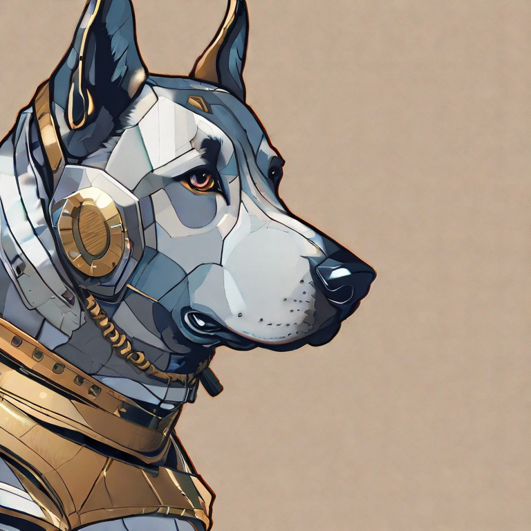
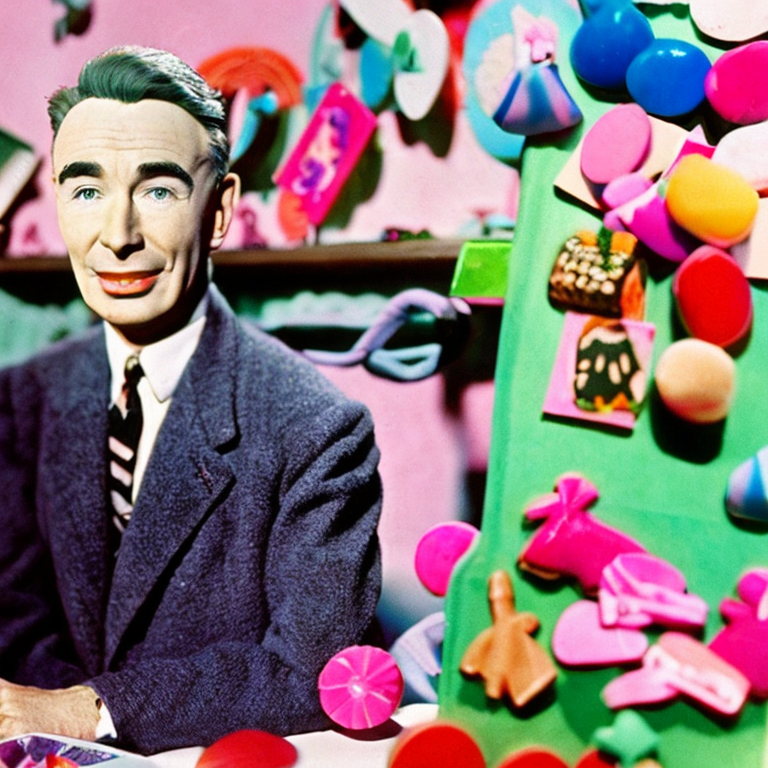

# Stable_Diffusion.mojo

Some images I generated with Stable Diffusion and Stable Diffusion XL... what if we could generate them with Mojo?
<div style="display: flex; justify-content: space-around;">
    
    
    
</div>

## Overview 💡
This is a 100% Mojo implementation of a forward pass of a mini Stable Diffusion model. Every component of the model was implemented from scratch, from basic integers and floats all the way to matrix multiplications, convolutions, image arrays, and operations that exist in PyTorch, such as linear layers, upsampling, and broadcasting. To view these operations in Mojo and use them in your project, check our helpers/utils.mojo. This will save you time, as you will not need to implement them from scratch. In this project, however, the primary use of these basic building blocks was to construct cross-attention modules, encoders, decoders, a diffusion module, CLIP, and other components of the Stable Diffusion pipeline.

The goal of this project is to provide a basic implementation of a model that, albeit smaller, follows a very similar architecture as Stable Diffusion. My hope is that this implementation can be used by anyone who wants to modify the given code to load their own Stable Diffusion weights into this model. The code is divided as follows:

* vae.mojo: A Variational Autoencoder (VAE), including both an encoder and decoder. The encoder is used to encode pre-existing images so that they can be used by the Stable Diffusion model. The decoder is used by all image generation forward passes, regardless of whether an initial image is provided or not

* sampler.mojo: An implementation of a DDPM sampler

* pipeline.mojo: Creates a Mojo pipeline that takes in a text prompt (and, optionally, an image) and computes a forward pass through the model

* diffusion.mojo: Code for the diffusion part of the Stable Diffusion model (comprised of a UNet, Time Embedding, and output layer)

* clip.mojo: Comprised of clip embeddings and a CLIP player, it implements the structs necessary to generate a CLIP text encoder used by the inference pipeline

* helpers folder: Contains important low-level functions used everywhere in the code (such as convolution, image resizing, matrix multiplications, etc.) in the utils.mojo file. Also Contains the attention modules (self-attention, cross-attention) in the attention.mojo file.

* demo.mojo: A simple example of how to run a forward pass

* tokenizer_creation.py: A Python file that retrieves the CLIP tokenizer from Hugging Face and stores it as tokenizer_clip.bin. This .bin file will be read during image generation to load the CLIP tokenizer values. For this reason, this Python file should be executed before any forward passes are run, since this will allow you to recreate a CLIP tokenizer with real values in your machine.


## Usage 🔨

* First, retrive the CLIP tokenizer file 
````
python tokenizer_creation.py
````

* Next, compile the "helpers" package
````
mojo package helpers -o "helpers.mojopkg"
````

* Then, modify vae.mojo and diffusion.mojo so that the structs defined in these files have the same architecture as the model whose weights you are loading in. Since there are various versions of Stable Diffusion (XL, mini, etc.) in this code I have provided a very small, basic implementation of the VAE and Diffusion components.

* Next, load your weights into the model. To do so, check out the "Tokenizer" struct in helpers/utils.mojo. The __init__ function in this struct shows how to load weights from a .bin file into a struct, so the same process can be applied to any other structs (CLIP, Encoder, Diffusion, etc) for which you would like to load weights. Just copy and paste that code and modify as needed. This file input / output logic was retrieved from the amazing Llama2.mojo project, linked in the "thanks" section. 

* Lastly, modify demo.mojo file to set the parameters you would like to use for the model and run a forward pass
````
mojo demo.mojo
````

Furthermore, feel free to change the "image_size" alias in the pipeline.mojo file to fit the image width / length that you desire to use!

## Next Steps for this project (please fork and open a pull request if you would like to implement this!)

* Load weights into the model by modifying vae.mojo and diffusion.mojo. One good source of weights is Stable Diffusion mini, available [here](https://huggingface.co/segmind/tiny-sd/tree/main). To load weights, check out the __init__ function of the Tokenizer struct in utils.mojo. An identical method can be used to initialize the weights for every other struct in the model from a .bin file
    * For vae.mojo: Add more residual blocks, attention blocks, and convolution layers to the encoder and decoder structs in order to match the architecture of the Stable Diffusion model whose weights are being used (in this example, Stable Diffusion mini)
    * For diffusion.mojo: Similarly, add more layers to the UNet defined in diffusion.mojo to match the architecture of the model whose weights you are loading. Make sure to modify the __forward__ function of Unet_Attention_Block to make the dimensions of the variable "out" match those of the "residual short" variable as opposed to simply concatenating the "out" variable multiple times like I am currently doing in this toy example
* Benchmark the speed of this Mojo implementation against the original Python-based one. 

## Thanks 🙏

* Thanks to the extraordinary [Pytorch Stable Diffusion](https://github.com/hkproj/pytorch-stable-diffusion) implementation available here. This was the primary source of inspiration for this project.

* Thanks to the awesome [Llama2 Mojo implementation](https://github.com/tairov/llama2.mojo) that helped me set up the tokenizer and taught me how to load bianry values into Mojo.

* Thanks to [this amazing Karpathy tutorial](https://github.com/karpathy/llama2.c/blob/master/tokenizer.py) for creating a Llama2 tokenizer

* Thanks to Modular for providing the #mojo-help Discord channel, which clarified many of my questions about the Mojo programming language.
